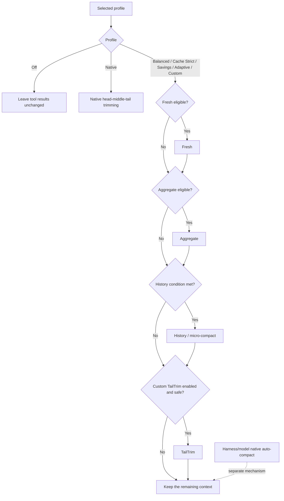

# dsh-context-compression-selector

> An auditable tool-result context-compression selector for DeepSeek Harness.

[中文说明](README.zh.md) · [Interactive courseware](https://github.com/WilliamShi666/Slides-that-explain-dsh-context-compression-selector#english) · [中文课件](https://github.com/WilliamShi666/Slides-that-explain-dsh-context-compression-selector#中文) · [Report an issue](https://github.com/WilliamShi666/dsh-context-compression-selector/issues)

> [!IMPORTANT]
> This project currently supports **DeepSeek models only**. Its lossless measurement and lossy tool-result compression depend on the bundled official DeepSeek tokenizers. The exact supported model IDs in this release are `deepseek-v4-flash`, `deepseek-v4-pro`, and `deepseek-v4-flash-vision-exp`. Other DeepSeek Harness models, including non-DeepSeek providers, fail open and retain their original tool results.

## What it is

Long-running agent tasks can accumulate a large amount of tool output. This community plugin adds selectable, auditable policies for reducing that tool-result context without modifying DeepSeek Harness core.

- **Fresh** pre-compresses a newly oversized tool-result segment before the model receives it.
- **Aggregate** pre-compresses fresh material again when it still grows beyond its configured budget.
- **History / micro-compact** replaces eligible old tool results while preserving recent working context.
- **TailTrim** is an optional Custom-only tail reduction path.
- **Native** preserves the original Harness-style head/middle/tail tool-result trimming as one explicit profile.

The plugin records the selected policy and each decision: stage, reducer, trigger, skip reason, and exact token counts where available.

## Settings UI

Choose a compression profile from DeepSeek Harness settings, and set the Auto Compact trigger level in the same section. Settings are frozen when a session first observes them, so changing a setting affects new sessions rather than silently changing an active task.

### Auto Compact threshold

The selector settings section exposes `autoCompact.thresholdPercent`: an integer between 50% and 90% (step 1%), defaulting to 80%. `70% / 80% / 85%` are quick-fill suggestions only — any value such as 73% saves fine. Values outside the recommended 70–85% band show a risk note but remain savable. The level is written into the generated `compaction-basic` composition as `thresholdRatio` and, from the same read, into the plugin runtime's deployment config, so one standing generation can never run Auto Compact and micro compact on two different thresholds. It rescales the standard-profile History trigger, minimum reclaim, recent-token tail, and the micro-compact last-chance deadline `D = floor(A × 0.875)` around `A = floor(C × a)`, where `a = thresholdPercent / 100` is used as a floating-point ratio — the same arithmetic order `compaction-basic` itself uses. At the default 80% on a 1M context the previous numbers are reproduced exactly. Fresh, Aggregate, Native single-result budgets, the 10-call working set, and the Auto Compact retain ratio are unchanged in this release; Custom stays manual.


## Who should use it

This is an advanced plugin. It is not designed to be friendly to most users without background knowledge of agent context, tool-result compression, context windows, prompt caching, and the difference between deterministic tool-result compression and model-driven auto-compaction.

If those terms are unfamiliar, start with the companion [interactive courseware](https://github.com/WilliamShi666/Slides-that-explain-dsh-context-compression-selector#english). It explains the mechanisms, profiles, trade-offs, and practical usage before you change compression settings.

## Model support and safety

The runtime ships pinned official DeepSeek V4 tokenizer assets and verifies their SHA-256 hashes. Exact token measurement is a safety requirement: without it, the plugin does not perform a lossy rewrite.

| Model route | Selector compression |
| --- | --- |
| `deepseek-v4-flash` | Supported |
| `deepseek-v4-pro` | Supported |
| `deepseek-v4-flash-vision-exp` | Supported: exact text counting plus bounded image-token estimates; image-bearing rewrite candidates remain exact-ineligible and intact |
| Other DeepSeek model IDs | Not supported; fail open |
| Non-DeepSeek models in DeepSeek Harness | Not supported; fail open |

The vision model is served by a separately bundled official tokenizer pinned at `deepseek-ai/DeepSeek-V4-Flash-Vision-Exp` revision `6821d6ad3681a4b137b066b76094fa82ebd0a380` — it is deliberately not treated as a text Flash alias. Vision image tokens use a line-by-line port of the official image processor (patch size 14, downsample ratio 3, 384-token cap, min pixels, aspect clamp, and position-dependent alignment padding), validated against golden fixtures generated by executing the official Python implementation. A valid image is reported as `tokenizer-estimate`: the midpoint of the four possible alignment residues for its durable intrinsic dimensions, with 384 tokens retained as the per-image conservative upper bound. If dimensions are malformed or cannot be evaluated, the plugin charges a fixed 256-token fallback instead of making the visual surface unavailable. These values are deliberately approximate because the absolute prompt position and the adapter's final request-image projection — including per-route pixel-budget overrides and byte-cap reprojection — are not exposed through the current measurement seam; an 800×800 upload projected to 512×512 can therefore differ materially from its intrinsic estimate. The estimate improves pressure accounting but never authorizes a lossy rewrite: image-bearing tool-result candidates remain exact-ineligible and are never rewritten, deleted, or counted as zero. Exposing projected dimensions and absolute serialized positions upstream would allow a later exact counter.

“Fail open” means the original tool result remains in context and an auditable skip or failure record is emitted. The selector does not estimate tokens with character counts and must not be treated as a generic multi-provider compressor.

## Pre-compression and historical compression are different

**Fresh and Aggregate are pre-compression, not History compression.** They reduce a newly produced tool result before it is first sent to the model. The reducer selects a safe strategy from the tool name, command arguments, and content evidence—for example JSON, search, file read, Git, package, build, test, or shell output. Because this only bounds new material and does not rewrite the serialized prompt prefix already sent to the provider, it does not break an existing prompt cache.

**History / micro-compact is historical compression.** It selects old tool results outside the protected working set, then replaces each selected result in active context with a short, recoverable multi-line placeholder beginning `[Old tool result content cleared from active context]`. The placeholder retains the tool name, status, source reference, and retrieval instruction, while the original durable event remains recoverable. This intentionally rewrites an already-sent prefix, so it breaks or restarts the prompt cache. History protects the union of the newest 10 agent tool calls and the latest 64,000 tool-result tokens before it considers older results.

## How a profile is evaluated



An enabled mode is not guaranteed to run. Its trigger, safety checks, exact tokenizer availability, and required reclaim must all pass. For all selector profiles other than `native`, Harness-native head/middle/tail tool-result trimming is disabled so that the selector is the only tool-result compactor. Model-driven native auto-compaction remains a separate Harness/model mechanism and is only audited separately.

## Profiles

Profiles are orchestration policies, not separate compression algorithms. A profile composes the available methods by deciding which ones are enabled, their evaluation order, thresholds, retention set, minimum reclaim, and cache-safety trade-offs.

| Profile | Fresh / Aggregate | History | Native tool trimming | TailTrim |
| --- | --- | --- | --- | --- |
| Off | Disabled | Disabled | Disabled | Disabled |
| Native | Disabled | Disabled | Enabled (`4096 → 2048`) | Disabled |
| Balanced | `8192 → 3072` / `32768 → 12288` | Routine at `500000`; retain 10 recent calls and a 64,000-token tail | Disabled | Disabled |
| Cache Strict | Same as Balanced | Full-request last chance at `D = 700000`; once `D` is reached, the planner may run even when tool-result tokens are at or below `H = 600000` | Disabled | Disabled |
| Savings | `4096 → 1536` / `16384 → 4096` | Routine at `400000` | Disabled | Disabled |
| Adaptive | Same as Balanced | Conservative estimated routing at `500000`, with a capacity-pressure safety override | Disabled | Disabled |
| Custom | Configurable | Configurable | Disabled | Optional, disabled by default |

History protects the union of the newest 10 agent tool calls and the latest 64,000 tool-result tokens. Older eligible results are rewritten only when the policy can reclaim its required minimum. The History trigger, minimum-reclaim, and tail numbers in the table are the values at the default 80% Auto Compact level; they rescale with `A = floor(C × a)` (`a = thresholdPercent / 100`, floating-point ratio) once you change the threshold (see Auto Compact threshold above).

### Adaptive limitation and upstream capability request

The Adaptive profile is shown in the settings UI as **Conservative cost**. It is intentionally not a perfect adaptive cache optimizer: it makes a conservative estimate from the currently available request usage, model pricing, and same-tokenizer measurements, and fails closed when those inputs are incomplete. It cannot observe or control the exact cache breakpoint, cache allocation, or cache lifetime.

Perfect adaptive behavior requires DeepSeek to expose cache-breakpoint control and cache TTL/lifetime evidence. Those capabilities are not currently available to this plugin through public DeepSeek Harness or provider APIs. Upstream capability request: @deepseek-ai and [deepseek-ai/deepseek-harness](https://github.com/deepseek-ai/deepseek-harness).

## Compatibility

- Verified against DeepSeek Harness `dsh-v0.1.1-rc.2` using public plugin and profile APIs only.
- Requires Node `^22.19.0 || >=24`.
- The project contains only this Bundle and its runtime; it does not vendor or modify DeepSeek Harness core.
- This is an unofficial community project and is not affiliated with or endorsed by DeepSeek.

## Development and security

Run the release-oriented local checks with:

```sh
pnpm run typecheck
pnpm run test
pnpm run test:built
pnpm run test:e2e:packed
pnpm run verify:release
```

See [CONTRIBUTING.md](CONTRIBUTING.md) for development expectations, [SECURITY.md](SECURITY.md) for vulnerability reporting, and [THIRD_PARTY_NOTICES.md](THIRD_PARTY_NOTICES.md) for bundled tokenizer provenance and licenses.

## Install

The newest package release is `0.1.0-beta.3` on the `beta` channel. Install the single Bundle entry package into a Harness profile:

```sh
dsh plugin --profile web add dsh-context-compression-selector@beta
dsh --profile web --dump-config
```

The selector package declares the Harness Bundle manifest field `dsh.bundle.patch`, so `dsh plugin --profile <name> add <package>` is the standard DeepSeek Harness installation path for an out-of-tree Bundle. Its exact-version runtime dependency, `dsh-context-compression-selector-runtime`, is installed automatically; do not install or wire the two packages separately.

Restart the selected profile after installation. The config dump should list the selector Bundle as active.

To update or remove it:

```sh
dsh plugin --profile web up dsh-context-compression-selector@beta
dsh plugin --profile web remove dsh-context-compression-selector
```

`latest` intentionally remains `0.1.0-beta.1`; use `@beta` to install the current release.
