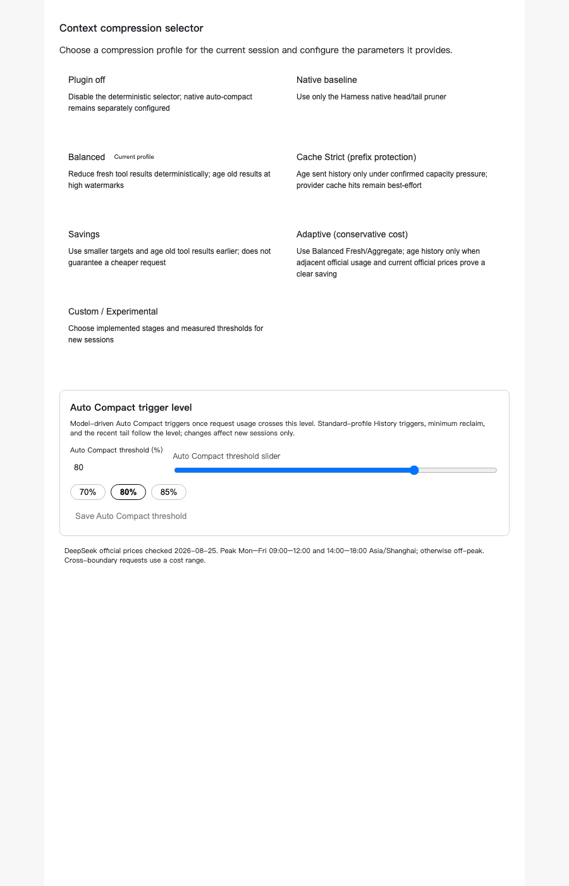
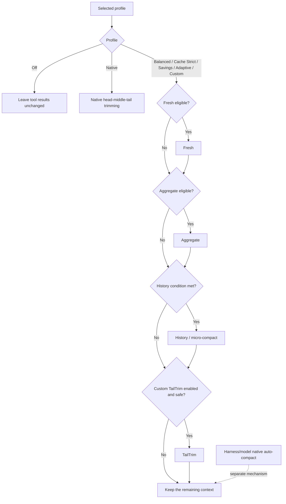

# dsh-context-compression-selector

> An auditable tool-result context-compression selector for DeepSeek Harness.

[Chinese documentation](README.zh.md) · [Interactive courseware](https://github.com/WilliamShi666/Slides-that-explain-dsh-context-compression-selector#english) · [中文课件](https://github.com/WilliamShi666/Slides-that-explain-dsh-context-compression-selector#中文) · [Report an issue](https://github.com/WilliamShi666/dsh-context-compression-selector/issues)

> [!IMPORTANT]
> This project currently supports **DeepSeek models only**. Its lossless measurement and lossy tool-result compression depend on the bundled official DeepSeek tokenizer. The exact supported model IDs in this release are `deepseek-v4-flash` and `deepseek-v4-pro`. `deepseek-v4-flash-vision-exp` is **not supported**; other DeepSeek Harness models, including non-DeepSeek providers, fail open and retain their original tool results.

## What it is

Long-running agent tasks can accumulate a large amount of tool output. This community plugin adds selectable, auditable policies for reducing that tool-result context without modifying DeepSeek Harness core.

- **Fresh** compresses a newly oversized tool-result segment.
- **Aggregate** re-compresses material that has already been reduced but grows again.
- **History / micro-compact** replaces eligible old tool results while preserving recent working context.
- **TailTrim** is an optional Custom-only tail reduction path.
- **Native** preserves the original Harness-style head/middle/tail tool-result trimming as one explicit profile.

The plugin records the selected policy and each decision: stage, reducer, trigger, skip reason, and exact token counts where available.

## Settings UI

Choose a compression profile from DeepSeek Harness settings. Profile settings are frozen when a session first observes them, so changing a setting affects new sessions rather than silently changing an active task.



## Who should use it

This is an advanced plugin. It is not designed to be friendly to most users without background knowledge of agent context, tool-result compression, context windows, prompt caching, and the difference between deterministic tool-result compression and model-driven auto-compaction.

If those terms are unfamiliar, start with the companion [interactive courseware](https://github.com/WilliamShi666/Slides-that-explain-dsh-context-compression-selector#english). It explains the mechanisms, profiles, trade-offs, and practical usage before you change compression settings.

## Model support and safety

The runtime ships pinned official DeepSeek V4 tokenizer assets and verifies their SHA-256 hashes. Exact token measurement is a safety requirement: without it, the plugin does not perform a lossy rewrite.

| Model route | Selector compression |
| --- | --- |
| `deepseek-v4-flash` | Supported |
| `deepseek-v4-pro` | Supported |
| `deepseek-v4-flash-vision-exp` | Not supported; fail open |
| Other DeepSeek model IDs | Not supported; fail open |
| Non-DeepSeek models in DeepSeek Harness | Not supported; fail open |

“Fail open” means the original tool result remains in context and an auditable skip or failure record is emitted. In particular, the Flash vision model has a price catalog entry but no verified bundled tokenizer mapping, so it is deliberately not treated as a text Flash alias. The selector does not estimate tokens with character counts and must not be treated as a generic multi-provider compressor.

## How a profile is evaluated



An enabled mode is not guaranteed to run. Its trigger, safety checks, exact tokenizer availability, and required reclaim must all pass. For all selector profiles other than `native`, Harness-native head/middle/tail tool-result trimming is disabled so that the selector is the only tool-result compactor. Model-driven native auto-compaction remains a separate Harness/model mechanism and is only audited separately.

## Profiles

| Profile | Fresh / Aggregate | History | Native tool trimming | TailTrim |
| --- | --- | --- | --- | --- |
| Off | Disabled | Disabled | Disabled | Disabled |
| Native | Disabled | Disabled | Enabled (`4096 → 2048`) | Disabled |
| Balanced | `8192 → 3072` / `32768 → 12288` | Routine at `500000`; retain 10 recent calls and a 64,000-token tail | Disabled | Disabled |
| Cache Strict | Same as Balanced | Capacity pressure: over `600000` tool-result tokens and at least 70% routed-context utilization | Disabled | Disabled |
| Savings | `4096 → 1536` / `16384 → 4096` | Routine at `400000` | Disabled | Disabled |
| Adaptive | Same as Balanced | Adaptive at `500000`, with a capacity-pressure safety override | Disabled | Disabled |
| Custom | Configurable | Configurable | Disabled | Optional, disabled by default |

History protects the union of the newest 10 agent tool calls and the latest 64,000 tool-result tokens. Older eligible results are rewritten only when the policy can reclaim its required minimum.

## Compatibility

- Verified against DeepSeek Harness `dsh-v0.1.1-rc.2` using public plugin and profile APIs only.
- Requires Node `^22.19.0 || >=24`.
- The project contains only this Bundle and its runtime; it does not vendor or modify DeepSeek Harness core.
- This is an unofficial community project and is not affiliated with or endorsed by DeepSeek.

## Development and security

Run the release-oriented local checks with:

```sh
pnpm run typecheck
pnpm run test
pnpm run test:built
pnpm run test:e2e:packed
pnpm run verify:release
```

See [CONTRIBUTING.md](CONTRIBUTING.md) for development expectations, [SECURITY.md](SECURITY.md) for vulnerability reporting, and [THIRD_PARTY_NOTICES.md](THIRD_PARTY_NOTICES.md) for bundled tokenizer provenance and licenses.

## Install

The newest package release is `0.1.0-beta.2` on the `beta` channel. Install the single Bundle entry package into a Harness profile:

```sh
dsh plugin --profile web add dsh-context-compression-selector@beta
dsh --profile web --dump-config
```

The selector package declares the Harness Bundle manifest field `dsh.bundle.patch`, so `dsh plugin --profile <name> add <package>` is the standard DeepSeek Harness installation path for an out-of-tree Bundle. Its exact-version runtime dependency, `dsh-context-compression-selector-runtime`, is installed automatically; do not install or wire the two packages separately.

Restart the selected profile after installation. The config dump should list the selector Bundle as active.

To update or remove it:

```sh
dsh plugin --profile web up dsh-context-compression-selector
dsh plugin --profile web remove dsh-context-compression-selector
```

`latest` intentionally remains `0.1.0-beta.1`; use `@beta` to install the current release.
