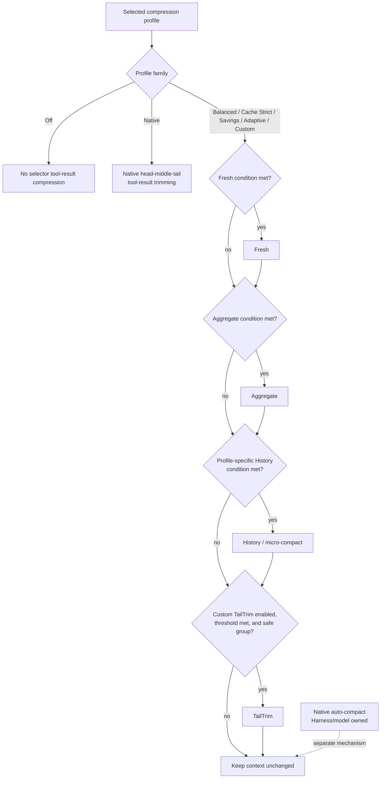

# dsh-context-compression-selector

> Auditable Context Compression for DeepSeek Harness
> DeepSeek Harness 的可审计上下文压缩插件

## Status / 状态

Source code is public on GitHub and the package is available on NPM. The newest release is `0.1.0-beta.2` on the `beta` channel; the registry's default `latest` remains `0.1.0-beta.1`.

源码已公开到 GitHub，插件包也已发布到 NPM。最新版本是 `beta` 通道上的 `0.1.0-beta.2`；registry 的默认 `latest` 仍为 `0.1.0-beta.1`。

This is an unofficial community plugin for DeepSeek Harness. It extends Harness through its public plugin/profile interfaces, without patching Harness core source code.

这是 DeepSeek Harness 的非官方社区插件。它通过 Harness 的公开插件和 Profile 接口扩展功能，不修改 Harness 核心源码。

## What it does / 它做什么

Long-running agent tasks need predictable ways to reduce context pressure while preserving useful history. This bundle provides a selectable, auditable compression policy:

长时间运行的智能体任务需要在保留有用历史的同时，可靠地降低上下文压力。本插件提供可选择、可审计的压缩策略：

- **Fresh**: compresses a newly accumulated conversation segment.
  **Fresh**：压缩刚累积的一段对话内容。
- **Aggregate**: reduces already-compressed material when it grows again.
  **Aggregate**：当已经压缩过的内容再次增长时进一步归并。
- **History / micro-compact**: ages older tool-result history under routine or capacity-pressure conditions.
  **History / micro-compact**：在日常或容量压力条件下老化较早的工具结果历史。
- **TailTrim**: safely trims eligible older tool groups from the tail when configured and triggered.
  **TailTrim**：在已配置且达到条件时，安全裁剪尾部符合条件的较早工具组。
- **Native auto-compact audit**: records native Harness auto-compaction separately from plugin compression, so the two are never confused.
  **原生 auto-compact 审计**：将 Harness 原生自动压缩与插件压缩分开记录，避免混淆。

Each compression decision produces structured audit information such as stage, reducer, trigger reason, and token values before and after the operation when those values are available.

每一次压缩决策都会产生结构化审计信息；在数据可用时，其中包括 stage、reducer、触发原因，以及操作前后的 token 值。

## Why a selector? / 为什么需要选择器？

Native DeepSeek Harness tool-result compaction offers one general approach: retain the beginning and the end of a tool result and remove its middle. It is a useful safeguard, but it gives users only one choice. In long agent tasks, the middle of a tool result can contain decisions, intermediate findings, errors, or references that the agent still needs. A single head-and-tail truncation rule cannot express every safe trade-off.

DeepSeek Harness 原生的工具结果压缩只有一种通用方式：保留工具结果的开头与结尾，截去中间部分。它是一种有用的保护措施，但用户只有这一种选择。在长时间智能体任务中，工具结果的中间部分可能包含决策、中间发现、错误信息或后续仍需引用的内容。单一的“保留头尾、截去中间”规则无法表达所有安全的取舍。

The Context Compression Selector adds several deliberately different tool-result compression strategies. It lets the policy choose between fresh-segment compression, re-aggregation, historical aging, and safe tail trimming instead of assuming that every large result should be cut in the same way. Every path is separately auditable so users can see which strategy actually ran.

上下文压缩选择器增加了多种有意区分的工具结果压缩策略。策略可以在新鲜片段压缩、再次归并、历史老化与安全尾部裁剪之间选择，而不是假定每一个过大的结果都应以同一种方式截断。每条路径都有独立审计记录，因此用户可以看到实际运行的是哪种策略。

## Scope and non-goals / 当前范围与非目标

This release focuses on optimizing and extending **tool-result compression**. It does not replace, tune, or claim to optimize the model-driven native auto-compact strategy. Native auto-compact remains a Harness/model concern and is recorded separately only to make operational evidence easier to interpret. This scope is intentional: the project is maintained in personal time, so the first public version concentrates on the area that can be extended safely through the plugin contract and verified end to end.

当前版本专注于优化和扩展**工具结果压缩**。它不替换、不调参，也不声称优化由模型驱动的原生 auto-compact 策略。原生 auto-compact 仍属于 Harness/模型侧的能力；插件仅将其单独记录，以便正确解读运行证据。这个范围是有意为之：项目维护时间有限，因此首个公开版本集中在可以通过插件契约安全扩展、并能端到端验证的部分。

## Modes and profiles: two different layers / 模式与 Profile：两个不同层次

A **mode** is one compression action with its own eligibility checks, trigger, reducer, and audit event. A **profile** is the policy that combines modes: it decides which modes are enabled, their order, thresholds, retention rules, and safety switches. Modes are the building blocks; a profile is the complete recipe.

**模式（mode）**是一个单独的压缩动作，拥有自己的资格检查、触发条件、reducer 和审计事件。**Profile** 则是将多种模式组合起来的策略：它决定启用哪些模式、它们的顺序、阈值、保留规则和安全开关。模式是积木，Profile 是完整配方。



The flow first shows profile composition, then the conceptual decision order inside the multi-mode profiles. A mode runs only when both its configured threshold and its safety/eligibility conditions are satisfied; an enabled mode is not a promise that it will run on every task. TailTrim is a Custom-only optional path. Native auto-compact is deliberately outside the chain: Harness/the model owns it, and the plugin records it separately rather than controlling it.

上图先展示 Profile 的组成，再展示多模式 Profile 内部的概念性决策顺序。每个模式只有在其配置阈值以及安全/资格条件都满足时才会运行；“已启用”并不等于它会在每个任务中触发。TailTrim 是仅属于 Custom 的可选路径。原生 auto-compact 被有意置于这条链路之外：它属于 Harness/模型，插件只单独记录它，而不会控制它。

### Mode comparison / 各模式对照

| Mode | What it is for | What happens when it runs | Ownership |
| --- | --- | --- | --- |
| Fresh | A newly accumulated tool-result segment becomes too large. | Compresses the fresh segment to its configured target. | Plugin |
| Aggregate | Previously compressed material has grown large again. | Re-aggregates that material into a smaller representation. | Plugin |
| History / micro-compact | Older tool-result history should be aged, either routinely or under capacity pressure. | Reclaims older eligible history while retaining the configured recent tool-call and tool-result token-tail working set. | Plugin |
| TailTrim | Context pressure remains high and there is a safe eligible tool group near the tail. | Removes eligible older tool groups while preserving traceability and recovery evidence. | Plugin |
| Native auto-compact | Harness/model decides that its own automatic compaction is needed. | A model-driven native compaction occurs independently of this plugin. | Harness / model |

| 模式 | 适用场景 | 实际运行时做什么 | 归属 |
| --- | --- | --- | --- |
| Fresh | 新累积的工具结果片段过大。 | 将该新鲜片段压缩到已配置的目标大小。 | 插件 |
| Aggregate | 已压缩的内容再次增长到较大规模。 | 将这些内容再次归并为更小的表示。 | 插件 |
| History / micro-compact | 较早的工具结果历史需要在日常或容量压力下老化。 | 在保留配置的最近工具调用与工具结果 token 尾窗工作集的前提下，回收合格的较早历史。 | 插件 |
| TailTrim | 上下文压力仍高，且尾部附近存在安全、合格的工具组。 | 移除合格的较早工具组，同时保留可追溯性和恢复证据。 | 插件 |
| Native auto-compact | Harness/模型判定需要自身的自动压缩。 | 与本插件无关的、模型驱动的原生压缩。 | Harness / 模型 |

## Compression profiles in detail / 上下文压缩 Profile 详解

In this project, a **compression profile** is not a Harness preset. It is the selector's own named policy: a precise combination of tool-result compression modes, thresholds, retention rules, and safety behavior. The public profiles are `off`, `native`, `balanced`, `cache-strict`, `savings`, `adaptive`, and `custom`. The five main user-facing choices are Native, Balanced, Cache Strict, Savings, and Custom; Off and Adaptive are also available as explicit policy choices.

在本项目中，**上下文压缩 Profile** 不是 Harness 的 preset。它是选择器自身的命名策略：由工具结果压缩模式、阈值、保留规则和安全行为组成的精确组合。公开的 Profile 包括 `off`、`native`、`balanced`、`cache-strict`、`savings`、`adaptive` 与 `custom`。面向用户的五个主要选择是 Native、Balanced、Cache Strict、Savings 与 Custom；此外还提供明确的 Off 与 Adaptive 策略。

### Profile composition / Profile 的组成

| Compression profile | Fresh / Aggregate | History behavior | Native head-middle-tail tool trimming | TailTrim | Intended trade-off |
| --- | --- | --- | --- | --- | --- |
| Off | disabled | disabled | disabled | disabled | No selector-driven tool-result compression. |
| Native | disabled | disabled | enabled, `4096 → 2048` | disabled | Preserves the original single native-style tool-result approach. |
| Balanced | enabled, `8192 → 3072` / `32768 → 12288` | routine at `500000`; retain 10 calls + `64000` tool-result tokens; reclaim at least `96000` | disabled | Everyday balance of preservation and context control. |
| Cache Strict | enabled, same Fresh/Aggregate values as Balanced | capacity-pressure only at `600000` and 70% routed-context utilization; retain 10 calls + `64000` tool-result tokens; reclaim at least `128000` | disabled | Favors cache-prefix stability; delays history aging until real pressure. |
| Savings | enabled, `4096 → 1536` / `16384 → 4096` | routine at `400000`; retain 10 calls + `64000` tool-result tokens; reclaim at least `128000` | disabled | Earlier and stronger reduction for lower context cost. |
| Adaptive | enabled, same Fresh/Aggregate values as Balanced | adaptive at `500000`; retain 10 calls + `64000` tool-result tokens; reclaim at least `96000` | disabled | Uses the existing adaptive policy model; it is not a claim of exact future price optimization. |
| Custom | individually configurable | individually configurable | disabled | Custom-only, off by default | Full user control; the current default is shown below. |

| 压缩 Profile | Fresh / Aggregate | History 行为 | 原生“头-中-尾”工具结果裁剪 | TailTrim | 核心取舍 |
| --- | --- | --- | --- | --- | --- |
| Off | 关闭 | 关闭 | 关闭 | 关闭 | 不进行由选择器驱动的工具结果压缩。 |
| Native | 关闭 | 关闭 | 启用，`4096 → 2048` | 关闭 | 保留原有的单一原生风格工具结果处理方式。 |
| Balanced | 启用，`8192 → 3072` / `32768 → 12288` | 在 `500000` 日常触发；保留 10 次调用 + `64000` 工具结果 token；至少回收 `96000` | 关闭 | 在信息保留和上下文控制间取得日常平衡。 |
| Cache Strict | 启用，Fresh/Aggregate 与 Balanced 相同 | 仅容量压力下于 `600000` 触发；保留 10 次调用 + `64000` 工具结果 token；至少回收 `128000` | 关闭 | 优先维持缓存前缀稳定；只有真实压力时才老化历史。 |
| Savings | 启用，`4096 → 1536` / `16384 → 4096` | 在 `400000` 日常触发；保留 10 次调用 + `64000` 工具结果 token；至少回收 `128000` | 关闭 | 更早、更强地收缩，降低上下文成本。 |
| Adaptive | 启用，Fresh/Aggregate 与 Balanced 相同 | `500000` 下的 adaptive；保留 10 次调用 + `64000` 工具结果 token；至少回收 `96000` | 关闭 | 使用现有 adaptive 策略模型；不声称能精确预测未来价格最优解。 |
| Custom | 可逐项配置 | 可逐项配置 | 关闭 | 仅 Custom 可用，默认关闭 | 完全由用户控制；当前默认值见下表。 |

`native` is a tool-result profile, while **native auto-compact** is a separate Harness/model mechanism. These names are similar but must not be conflated: selecting the Native profile does not claim to tune the model-driven native auto-compact strategy.

`native` 是一个工具结果压缩 Profile；**native auto-compact** 则是另一套 Harness/模型机制。两者名称相似但不能混为一谈：选择 Native Profile 不代表会调节模型驱动的 native auto-compact 策略。

### Profile selection and session freezing / Profile 选择与 Session 冻结

Changing the selector profile changes the recipe for a **newly observed session**. Once a session first observes a selector policy, the full resolved snapshot is frozen for that session. This prevents a long-running task from silently changing behavior halfway through because a user later chose another profile or edited Custom settings. Harness presets are a separate concept: changing a Harness preset does not itself redefine the selector profile unless the selector setting is changed.

改变选择器 Profile 会改变**新观察到的 Session**所使用的配方。一旦 Session 首次观察到选择器策略，完整的解析后快照就会为该 Session 冻结。这避免长时间任务因为用户随后选择了另一 Profile 或编辑了 Custom 设置而在中途悄然改变行为。Harness preset 是另一个概念：切换 Harness preset 本身不会重新定义选择器 Profile，除非同时修改了选择器设置。

### Reading an audit record / 如何阅读一条审计记录

An audit record answers two separate questions: **which profile recipe was frozen for this session?** and **which individual mode, if any, actually ran for this request?** For example, a Custom profile may enable all four plugin modes, yet a short task can correctly show Fresh/History/TailTrim as “enabled but not triggered.” Conversely, a History event must state whether it was routine or capacity-pressure; it is not evidence that TailTrim or native auto-compact ran.

一条审计记录回答两个不同问题：**此 Session 冻结的是哪一份 Profile 配方？**以及**本次请求实际运行了哪个单独模式（如有）？**例如，Custom Profile 可以启用四种插件模式，但短任务中 Fresh/History/TailTrim 显示为“已启用但未触发”完全正常。反过来，一条 History 事件必须说明它是日常触发还是容量压力触发；它不能证明 TailTrim 或原生 auto-compact 也运行过。

## Design principles / 设计原则

- **Plugin-only** — no production patch to DeepSeek Harness core.
  **纯插件实现**——不对 DeepSeek Harness 核心做生产修改。
- **Fail open** — if a compression step cannot run safely, the original context is retained and the skip/failure is auditable.
  **安全降级**——若压缩步骤无法安全执行，保留原始上下文，并记录跳过或失败原因。
- **Frozen per-session policy** — a running session keeps the full policy snapshot it first observed; later setting changes apply to new sessions rather than silently changing an existing one.
  **按 Session 冻结策略**——运行中的 Session 保留其首次观察到的完整策略快照；之后修改设置只影响新 Session，不会悄然改变旧 Session。
- **Harness-preset compatibility** — a Harness preset is separate from a compression Profile. Switching a Harness preset preserves the selected compression Profile unless the user explicitly changes the selector; Minimal mode intentionally pauses the plugin.
  **Harness preset 兼容性**——Harness preset 与压缩 Profile 是两个概念。切换 Harness preset 时会保留已选压缩 Profile，除非用户明确修改选择器；Minimal mode 则有意暂停插件。

## Compatibility / 兼容性

Verified against DeepSeek Harness `dsh-v0.1.1-rc.2` using only the public plugin/profile contract.

已基于 DeepSeek Harness `dsh-v0.1.1-rc.2` 进行验证，仅使用公开的插件/Profile 契约。

The release consists of two NPM packages installed as one Harness bundle:

发布形态是两个 NPM 包、一个 Harness Bundle：

- `dsh-context-compression-selector` — policy selection, settings, and integration layer.
- `dsh-context-compression-selector-runtime` — runtime/tokenizer support shipped with the bundle.

Users install one plugin entry; they do not need to manually wire the two packages together.

用户只需安装一个插件入口，无需手动连接两个包。

## Installation / 安装

Install the current public release through the default registry tag:

通过默认 registry tag 安装当前公开版本：

```bash
dsh plugin --profile web add dsh-context-compression-selector
dsh --profile web --dump-config
```

The config dump should show the context-compression selector bundle as active for that profile.

配置导出中应显示该 context-compression selector bundle 已为该 Profile 激活。

## Default Custom policy / Custom 默认策略

The Custom profile is the everyday default. Its values are deliberately explicit: Fresh and Aggregate define when and how far to reduce a segment; History limits how much recent material remains protected; `pressure-break` controls the prefix-pressure decision; and TailTrim starts disabled so a user must opt in before eligible tail groups can be removed.

Custom Profile 是日常默认策略。其参数均有明确含义：Fresh 和 Aggregate 定义何时压缩以及压缩到多小；History 限定受保护的近期内容；`pressure-break` 控制前缀压力决策；TailTrim 则默认关闭，只有用户主动启用后才可能移除合格的尾部工具组。

| Component / 组件 | Everyday default / 日常默认值 | Meaning / 含义 |
| --- | --- | --- |
| Fresh | trigger `8192`, target `3072` | Reduce a fresh oversized segment. / 压缩过大的新鲜片段。 |
| Aggregate | trigger `32768`, target `12288` | Re-aggregate already compressed material that grew again. / 再次归并重新增长的已压缩内容。 |
| History / micro-compact | trigger `500000` tokens | Start aging eligible older tool-result history. / 开始老化合格的较早工具结果历史。 |
| History retention / History 保留 | latest 10 tool calls and `64000` tool-result tokens | Protect recent history before reclamation. / 回收前保护最近 10 次工具调用与 `64000` 工具结果 token。 |
| History minimum reclaim / History 最少回收 | `96000` tokens | Avoid a history operation that reclaims too little. / 避免回收量过小的 History 操作。 |
| Prefix policy | `pressure-break` | Select the pressure-oriented prefix decision path. / 选择面向压力的前缀决策路径。 |
| TailTrim | disabled; threshold `700000` tokens | Remains off unless enabled; its threshold is used after opt-in. / 未启用时保持关闭；启用后采用此阈值。 |

The History `500000` and TailTrim `700000` thresholds above are everyday defaults, not test-only overrides.

上表的 History `500000` 与 TailTrim `700000` 阈值是日常默认值，不是仅用于测试的临时覆盖值。

## Auditability / 可审计性

The plugin is built to answer “did it actually run?” with runtime evidence—not merely “does the code exist?” Audit records distinguish:

插件的目标是用运行证据回答“它是否真的执行过？”，而不是只证明“代码是否存在”。审计记录会区分：

- enabled but not triggered / 已启用但尚未达到触发条件；
- actually triggered, including the responsible stage and reducer / 已实际触发，并记录对应 stage 和 reducer；
- safely skipped, failed, or unavailable / 因安全条件、失败或能力不可用而跳过；
- plugin compression versus native Harness auto-compaction / 插件压缩与 Harness 原生自动压缩。

TailTrim audit records include source-payload recovery evidence where applicable, so removed eligible tool groups remain traceable.

TailTrim 在适用时会记录源 payload 恢复证据，使被移除的合格工具组仍然可追溯。

## Cache behavior / 缓存行为

This plugin does **not** claim a provider-specific cross-session cache identifier, breakpoint, or TTL mechanism. A forked child can inherit the parent session prefix through native Harness behavior; a newly spawned child does not automatically inherit it.

本插件**不**声称实现了供应商专用的跨 Session cache ID、breakpoint 或 TTL 机制。Fork 出来的子 Session 可以通过 Harness 原生行为继承父 Session 前缀；新建 spawn 子 Session 不会自动继承。

Two requests whose serialized prompt prefixes happen to be identical may naturally receive server-side cache reuse from DeepSeek, but an actual cache hit must be established from official request-level usage fields. The plugin does not guess which tool result was cached.

若两个请求序列化后的 prompt 前缀恰好一致，DeepSeek 服务端可能自然复用缓存；但是否实际命中必须以官方请求级 usage 字段为准。插件不会猜测具体哪条工具结果被缓存。

## Verification / 验证范围

The release candidate was checked with type checks, unit and built-artifact tests, package tests, clean-install verification, official-profile installation checks, and isolated end-to-end scenarios for Fresh, Aggregate, History (routine and capacity pressure), TailTrim, native auto-compact separation, policy freezing, preset behavior, and parent/child-session cache semantics.

发布候选已经过类型检查、单元与构建产物测试、包测试、干净安装验证、官方 Profile 安装检查，以及 Fresh、Aggregate、History（日常和容量压力）、TailTrim、原生 auto-compact 分离、策略冻结、preset 行为和父子 Session 缓存语义的隔离端到端场景验证。

No real DeepSeek API cache-hit claim is made unless the corresponding official usage fields are present.

只有在存在对应官方 usage 字段时，才会声明真实 DeepSeek API 缓存命中。

## Known Harness behavior / 已知 Harness 行为

On the verified Harness release, `pnpm peers check` may report warnings for host-provided peer packages. This is a Harness/profile packaging characteristic, not by itself proof that the bundle failed. The practical installation check is:

在已验证的 Harness 版本中，`pnpm peers check` 可能会对由宿主提供的 peer 包报告警告。这是 Harness/Profile 打包特征，本身不代表 Bundle 安装失败。实际安装检查应为：

```bash
dsh --profile web --dump-config
```

Confirm that the selector bundle is present and active in the resulting configuration.

确认导出的配置中存在且激活了 selector bundle。

## Development / 开发

This repository intentionally contains only the plugin bundle and its tests. It does not vendor or modify DeepSeek Harness core.

本仓库只包含插件 Bundle 及其测试，不会 vendoring 或修改 DeepSeek Harness 核心。

## License / 许可证

MIT. See [LICENSE](./LICENSE).

MIT。详见 [LICENSE](./LICENSE)。

## Project links / 项目链接

- GitHub: <https://github.com/WilliamShi666/dsh-context-compression-selector>
- Issues and feedback are welcome. / 欢迎通过 Issue 提出问题和反馈。

---

**Release note / 发布说明：** The newest beta release is `0.1.0-beta.2`; the default `latest` release remains `0.1.0-beta.1`. Future updates will use new immutable NPM version numbers; published versions are never overwritten.

**发布说明：** 最新 beta 版本为 `0.1.0-beta.2`，默认 `latest` 版本仍为 `0.1.0-beta.1`。之后的更新会使用新的、不可变的 NPM 版本号；已发布版本不会被覆盖。
