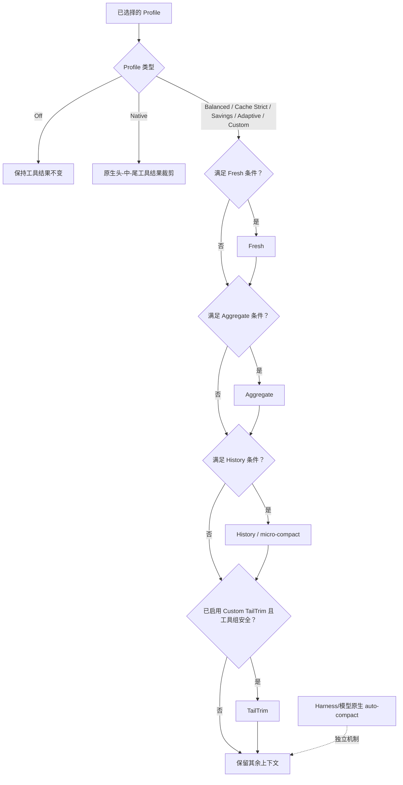

# dsh-context-compression-selector

> 面向 DeepSeek Harness 的、可审计的工具结果上下文压缩选择器。

[English README](README.md) · [交互式课件](https://github.com/WilliamShi666/Slides-that-explain-dsh-context-compression-selector) · [提交问题](https://github.com/WilliamShi666/dsh-context-compression-selector/issues)

> [!IMPORTANT]
> 本项目目前**只支持 DeepSeek 模型**。无损 token 测量与有损工具结果压缩依赖随包提供的 DeepSeek 官方 tokenizer。本版本精确支持的模型 id 为 `deepseek-v4-flash` 和 `deepseek-v4-pro`。`deepseek-v4-flash-vision-exp` **不受支持**；其他 DeepSeek Harness 模型（包括非 DeepSeek 提供商模型）会安全降级，保留原始工具结果。

## 它解决什么问题

长期运行的 Agent 任务会积累大量工具输出。本社区插件在不修改 DeepSeek Harness 核心的前提下，为这些工具结果提供可选择、可审计的上下文压缩策略。

- **Fresh**：压缩刚变得过大的工具结果片段。
- **Aggregate**：对已经压缩、但又重新增长的内容再次压缩。
- **History / micro-compact**：在保留近期工作上下文的前提下，替换符合条件的旧工具结果。
- **TailTrim**：仅 Custom 可启用的、可选的尾部裁剪路径。
- **Native**：将 Harness 风格的“保留头尾、裁掉中间”的工具结果裁剪保留为一个明确 Profile。

插件会记录已选择的策略及每次决策：stage、reducer、触发原因、跳过原因，以及可用时的精确 token 前后值。

## 设置界面

在 DeepSeek Harness 设置中选择压缩 Profile。一个 Session 首次观察到配置后会冻结该配置，因此之后修改设置只会影响新 Session，而不会悄悄改变正在运行的任务。


## 适合谁使用

这是一个高级插件。对于不了解 Agent 上下文、工具结果压缩、上下文窗口、Prompt Cache，以及“确定性工具结果压缩”和“模型驱动 Auto Compact”区别的大多数用户而言，它并不友好。

若这些概念还不熟悉，建议先阅读配套的[交互式课件](https://github.com/WilliamShi666/Slides-that-explain-dsh-context-compression-selector)。课件会先解释各机制、Profile、取舍和使用方法，再去修改压缩设置。

## 模型支持与安全边界

运行时随包提供固定版本的 DeepSeek V4 官方 tokenizer 资源，并验证其 SHA-256。精确 token 测量是安全前提：没有它时，插件不会执行有损改写。

| 模型路由 | 选择器压缩 |
| --- | --- |
| `deepseek-v4-flash` | 支持 |
| `deepseek-v4-pro` | 支持 |
| `deepseek-v4-flash-vision-exp` | 不支持；安全降级 |
| 其他 DeepSeek 模型 id | 不支持；安全降级 |
| DeepSeek Harness 中的非 DeepSeek 模型 | 不支持；安全降级 |

“安全降级”表示原始工具结果会保留在上下文中，并产生可审计的跳过或失败记录。特别是 Flash 视觉模型虽然有价格目录条目，但没有经过验证的 bundled tokenizer 映射，因此不能被当作文本 Flash 的别名。选择器不会使用字符数估算 token，也不能被当成通用、多提供商的压缩器。

## Profile 如何评估



一个模式处于“启用”状态，不表示它一定会运行。它的阈值、安全检查、精确 tokenizer 可用性和最低回收量都必须满足。除 `native` 外，所有选择器 Profile 都会关闭 Harness 原生的头-中-尾工具结果裁剪，使选择器成为唯一的工具结果压缩器。模型驱动的原生 auto-compact 仍是独立的 Harness/模型机制，插件只对它单独审计。

## Profile 一览

| Profile | Fresh / Aggregate | History | 原生工具裁剪 | TailTrim |
| --- | --- | --- | --- | --- |
| Off | 关闭 | 关闭 | 关闭 | 关闭 |
| Native | 关闭 | 关闭 | 启用（`4096 → 2048`） | 关闭 |
| Balanced | `8192 → 3072` / `32768 → 12288` | `500000` 常规触发；保护最近 10 次调用和 64,000 token 尾窗 | 关闭 | 关闭 |
| Cache Strict | 与 Balanced 相同 | 工具结果超过 `600000` token 且路由上下文利用率至少 70% 时触发 | 关闭 | 关闭 |
| Savings | `4096 → 1536` / `16384 → 4096` | `400000` 常规触发 | 关闭 | 关闭 |
| Adaptive | 与 Balanced 相同 | `500000` 下 adaptive；容量压力可作为安全覆盖 | 关闭 | 关闭 |
| Custom | 可配置 | 可配置 | 关闭 | 可选，默认关闭 |

History 会保护“最近 10 次 Agent 工具调用”和“最近 64,000 个工具结果 token”的并集。只有能够满足该策略最低回收量时，较早且合格的结果才会被改写。

## 兼容性

- 已基于 DeepSeek Harness `dsh-v0.1.1-rc.2` 验证，并且只使用公开的插件与 Profile API。
- 需要 Node `^22.19.0 || >=24`。
- 本项目只包含该 Bundle 与 runtime，不 vendoring 或修改 DeepSeek Harness 核心。
- 这是非官方社区项目，与 DeepSeek 不存在隶属或背书关系。

## 开发与安全

可使用以下命令运行面向发布的本地检查：

```sh
pnpm run typecheck
pnpm run test
pnpm run test:built
pnpm run test:e2e:packed
pnpm run verify:release
```

开发约定见 [CONTRIBUTING.md](CONTRIBUTING.md)，安全漏洞报告见 [SECURITY.md](SECURITY.md)，bundled tokenizer 的来源与许可证见 [THIRD_PARTY_NOTICES.md](THIRD_PARTY_NOTICES.md)。

## 安装

最新包版本是 `beta` 通道上的 `0.1.0-beta.2`。将唯一的 Bundle 入口包安装到某个 Harness Profile：

```sh
dsh plugin --profile web add dsh-context-compression-selector@beta
dsh --profile web --dump-config
```

选择器包在 manifest 中声明了 Harness Bundle 字段 `dsh.bundle.patch`，因此 `dsh plugin --profile <name> add <package>` 是符合 DeepSeek Harness 规范的树外 Bundle 安装方式。它的精确版本 runtime 依赖 `dsh-context-compression-selector-runtime` 会自动安装；不要分别安装或手动连接两个包。

安装后重启对应 Profile。配置导出中应显示选择器 Bundle 已激活。

更新或卸载：

```sh
dsh plugin --profile web up dsh-context-compression-selector
dsh plugin --profile web remove dsh-context-compression-selector
```

`latest` 目前有意保留在 `0.1.0-beta.1`；要安装当前版本请使用 `@beta`。
