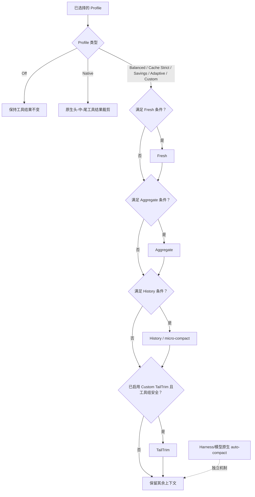

# dsh-context-compression-selector

> 面向 DeepSeek Harness 的、可审计的工具结果上下文压缩选择器。

[English README](README.md) · [English courseware](https://github.com/WilliamShi666/Slides-that-explain-dsh-context-compression-selector#english) · [中文课件](https://github.com/WilliamShi666/Slides-that-explain-dsh-context-compression-selector#中文) · [提交问题](https://github.com/WilliamShi666/dsh-context-compression-selector/issues)

> [!IMPORTANT]
> 本项目目前**只支持 DeepSeek 模型**。无损 token 测量与有损工具结果压缩依赖随包提供的 DeepSeek 官方 tokenizer。本版本精确支持的模型 id 为 `deepseek-v4-flash`、`deepseek-v4-pro` 和 `deepseek-v4-flash-vision-exp`。其他 DeepSeek Harness 模型（包括非 DeepSeek 提供商模型）会安全降级，保留原始工具结果。

## 它解决什么问题

长期运行的 Agent 任务会积累大量工具输出。本社区插件在不修改 DeepSeek Harness 核心的前提下，为这些工具结果提供可选择、可审计的上下文压缩策略。

- **Fresh**：在模型第一次接收前，对刚变得过大的工具结果片段进行预压缩。
- **Aggregate**：若新鲜内容仍超过已配置预算，则再次进行预压缩。
- **History / micro-compact**：在保留近期工作上下文的前提下，替换符合条件的旧工具结果。
- **TailTrim**：仅 Custom 可启用的、可选的尾部裁剪路径。
- **Native**：将 Harness 风格的“保留头尾、裁掉中间”的工具结果裁剪保留为一个明确 Profile。

插件会记录已选择的策略及每次决策：stage、reducer、触发原因、跳过原因，以及可用时的精确 token 前后值。

## 设置界面

在 DeepSeek Harness 设置中选择压缩 Profile，并在同一 section 设置 Auto Compact 触发水位。一个 Session 首次观察到配置后会冻结该配置，因此之后修改设置只会影响新 Session，而不会悄悄改变正在运行的任务。

### Auto Compact 阈值

选择器设置页提供 `autoCompact.thresholdPercent`：50%–90% 的整数（步长 1%），默认 80%。`70% / 80% / 85%` 仅是快捷填入值——73% 等任意合法值都可以保存。超出推荐区间 70%–85% 时会显示风险说明，但仍然允许保存。该水位会作为 `thresholdRatio` 写入生成的 `compaction-basic` 组合，并在同一次读取中写入插件 runtime 的部署配置，因此同一个 standing generation 绝不会让 Auto Compact 与 micro compact 运行在两个不同阈值上。它按 `A = floor(C × a)`（`a = thresholdPercent / 100`，以浮点比例参与运算——与 `compaction-basic` 自身的运算顺序一致）联动标准 Profile 的 History 触发值、最小回收量与近期尾窗，以及 micro compact 最后机会水位 `D = floor(A × 0.875)`。默认 80% 在 1M 上下文下完全复现原有数值。Fresh、Aggregate、Native 单结果预算、近期 10 次调用工作集和 Auto Compact retain 比例本版保持不变；Custom 保持手动。


## 适合谁使用

这是一个高级插件。对于不了解 Agent 上下文、工具结果压缩、上下文窗口、Prompt Cache，以及“确定性工具结果压缩”和“模型驱动 Auto Compact”区别的大多数用户而言，它并不友好。

若这些概念还不熟悉，建议先阅读配套的[中文课件](https://github.com/WilliamShi666/Slides-that-explain-dsh-context-compression-selector#中文)。课件会先解释各机制、Profile、取舍和使用方法，再去修改压缩设置。

## 模型支持与安全边界

运行时随包提供固定版本的 DeepSeek V4 官方 tokenizer 资源，并验证其 SHA-256。精确 token 测量是安全前提：没有它时，插件不会执行有损改写。

| 模型路由 | 选择器压缩 |
| --- | --- |
| `deepseek-v4-flash` | 支持 |
| `deepseek-v4-pro` | 支持 |
| `deepseek-v4-flash-vision-exp` | 支持：文本精确计数及有界图片 token 估算；含图片的改写候选仍不具备 exact 资格并保持原样 |
| 其他 DeepSeek 模型 id | 不支持；安全降级 |
| DeepSeek Harness 中的非 DeepSeek 模型 | 不支持；安全降级 |

视觉模型由独立捆绑的官方 tokenizer 提供服务，固定在 `deepseek-ai/DeepSeek-V4-Flash-Vision-Exp` revision `6821d6ad3681a4b137b066b76094fa82ebd0a380`——它不能被当作文本 Flash 的别名。视觉图片 token 使用官方图像处理算术的逐行移植计算（patch 14、downsample 3、384 token 上限、最小像素、宽高比裁剪与依赖位置的对齐 padding），并以官方 Python 参考实现生成的 golden fixtures 逐项验证。有效图片以 `tokenizer-estimate` 上报：根据持久化 intrinsic 尺寸计算四种可能的对齐位置并取中值，同时保留每张图片 384 token 的保守上限；尺寸畸形或无法计算时固定计为 256 token，不再使整个视觉 surface 变为不可用。这些数值仍是估算，因为当前计量边界没有公开绝对 prompt 位置及 adapter 最终请求图片投影（包括按路由覆盖像素预算和字节上限二次投影）；例如 800×800 上传被投影为 512×512 时，实际 token 会与 intrinsic 估算产生较大差异。估算值改善压力统计，但不会授权有损改写：含图片的工具结果候选仍不具备 exact 资格，不会被改写、删除或按零 token 计。若上游以后公开投影后尺寸与绝对序列化位置，即可进一步升级为精确计数。

“安全降级”表示原始工具结果会保留在上下文中，并产生可审计的跳过或失败记录。选择器不会使用字符数估算 token，也不能被当成通用、多提供商的压缩器。

## 预压缩与历史压缩并不相同

**Fresh 和 Aggregate 是预压缩，不是 History 压缩。**它们会在新工具结果第一次交给模型之前执行。reducer 会根据工具名、命令参数和内容证据选择安全策略，例如 JSON、搜索、文件读取、Git、包管理、构建、测试或 Shell 输出。它们只限制新增加的内容，不会改写已经发给提供商的序列化 prompt 前缀，因此不会破坏已有的 Prompt Cache。

**History / micro-compact 是历史压缩。**它会选择保护工作集之外的旧工具结果，并在活动上下文中将每一条选中的结果替换为短小、可恢复的多行占位记录；该记录以 `[Old tool result content cleared from active context]` 开始，并保留工具名、状态、来源引用和检索指令，原始的持久化事件仍可恢复。它有意改写已经发送过的前缀，因此会破坏或重新开始 Prompt Cache。History 在处理旧结果前，会保护“最近 10 次 Agent 工具调用”和“最近 64,000 个工具结果 token”的并集。

## Profile 如何评估



一个模式处于“启用”状态，不表示它一定会运行。它的阈值、安全检查、精确 tokenizer 可用性和最低回收量都必须满足。除 `native` 外，所有选择器 Profile 都会关闭 Harness 原生的头-中-尾工具结果裁剪，使选择器成为唯一的工具结果压缩器。模型驱动的原生 auto-compact 仍是独立的 Harness/模型机制，插件只对它单独审计。

## Profile 一览

Profile 是编排策略，不是彼此独立的压缩算法。一个 Profile 会组合这些已有方法，决定启用哪些方法、评估顺序、阈值、保留工作集、最低回收量以及缓存安全方面的取舍。

| Profile | Fresh / Aggregate | History | 原生工具裁剪 | TailTrim |
| --- | --- | --- | --- | --- |
| Off | 关闭 | 关闭 | 关闭 | 关闭 |
| Native | 关闭 | 关闭 | 启用（`4096 → 2048`） | 关闭 |
| Balanced | `8192 → 3072` / `32768 → 12288` | `500000` 常规触发；保护最近 10 次调用和 64,000 token 尾窗 | 关闭 | 关闭 |
| Cache Strict | 与 Balanced 相同 | 完整请求达到 `D = 700000` 时进入最后机会；达到 `D` 后，即使工具结果 token 不高于 `H = 600000`，planner 也可以运行 | 关闭 | 关闭 |
| Savings | `4096 → 1536` / `16384 → 4096` | `400000` 常规触发 | 关闭 | 关闭 |
| Adaptive | 与 Balanced 相同 | `500000` 下基于保守估算的路由；容量压力可作为安全覆盖 | 关闭 | 关闭 |
| Custom | 可配置 | 可配置 | 关闭 | 可选，默认关闭 |

History 会保护“最近 10 次 Agent 工具调用”和“最近 64,000 个工具结果 token”的并集。只有能够满足该策略最低回收量时，较早且合格的结果才会被改写。表中 History 触发值、最小回收量与尾窗均为 Auto Compact 默认水位 80% 下的数值；调整阈值后按 `A = floor(C × a)`（`a = thresholdPercent / 100`，浮点比例）同比缩放（见上文“Auto Compact 阈值”）。

### Adaptive 的当前限制与上游能力请求

Adaptive 在设置界面中显示为**保守成本**。它目前有意不是一个完美的自适应缓存优化器：它依据当前可得的请求 usage、模型价格和同一 tokenizer 的测量结果作保守估算；这些输入不完整时会安全降级。它无法观察或控制精确的缓存断点、缓存分配和缓存存活时间。

要实现完美的 Adaptive，需要 DeepSeek 提供缓存断点控制，以及缓存 TTL/存活时间证据。这些能力目前没有通过 DeepSeek Harness 或提供商公开 API 提供给本插件。上游能力请求：@deepseek-ai 和 [deepseek-ai/deepseek-harness](https://github.com/deepseek-ai/deepseek-harness)。

## 兼容性

- 已基于 DeepSeek Harness `dsh-v0.1.1-rc.2` 验证，并且只使用公开的插件与 Profile API。
- 需要 Node `^22.19.0 || >=24`。
- 本项目只包含该 Bundle 与 runtime，不 vendoring 或修改 DeepSeek Harness 核心。
- 这是非官方社区项目，与 DeepSeek 不存在隶属或背书关系。

## 开发与安全

可使用以下命令运行面向发布的本地检查：

```sh
pnpm run typecheck
pnpm run test
pnpm run test:built
pnpm run test:e2e:packed
pnpm run verify:release
```

开发约定见 [CONTRIBUTING.md](CONTRIBUTING.md)，安全漏洞报告见 [SECURITY.md](SECURITY.md)，bundled tokenizer 的来源与许可证见 [THIRD_PARTY_NOTICES.md](THIRD_PARTY_NOTICES.md)。

## 安装

最新包版本是 `beta` 通道上的 `0.1.0-beta.4`。将唯一的 Bundle 入口包安装到某个 Harness Profile：

```sh
dsh plugin --profile web add dsh-context-compression-selector@beta
dsh --profile web --dump-config
```

选择器包在 manifest 中声明了 Harness Bundle 字段 `dsh.bundle.patch`，因此 `dsh plugin --profile <name> add <package>` 是符合 DeepSeek Harness 规范的树外 Bundle 安装方式。它的精确版本 runtime 依赖 `dsh-context-compression-selector-runtime` 会自动安装；不要分别安装或手动连接两个包。

安装后重启对应 Profile。配置导出中应显示选择器 Bundle 已激活。

更新或卸载：

```sh
dsh plugin --profile web up dsh-context-compression-selector@beta
dsh plugin --profile web remove dsh-context-compression-selector
```

`latest` 目前有意保留在 `0.1.0-beta.1`；要安装当前版本请使用 `@beta`。

beta 通道兼容既有的 `0.1.1-rc.2` Harness peer 范围，以及官方 `dsh-v0.1.2-alpha.5` 版本。插件只使用 Harness 的公开扩展 API，不会修改 Harness 核心代码。
